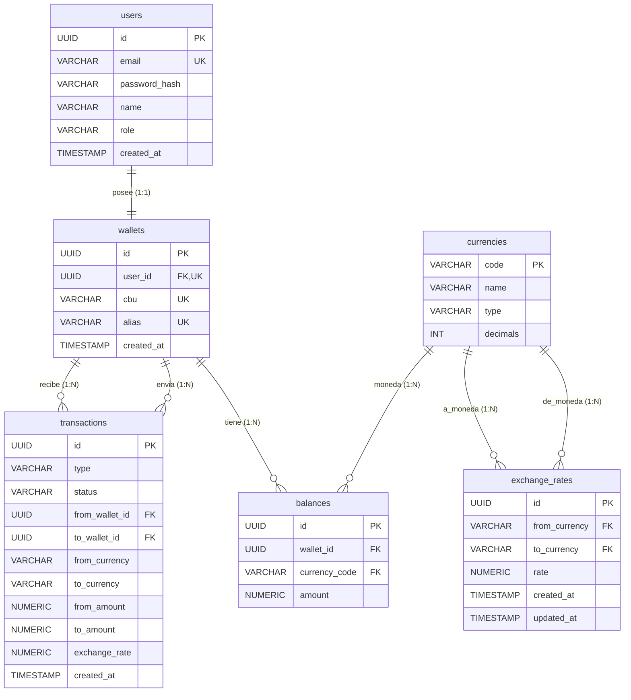

```mermaid
erDiagram
    %% --- FLUJO PRINCIPAL: USUARIO A BILLETERA ---
    users ||--|| wallets : "posee (1:1)"

    %% --- FLUJO DE FONDOS Y MOVIMENTOS ---
    wallets ||--o{ balances : "tiene (1:N)"
    wallets ||--o{ transactions : "envia (1:N)"
    wallets ||--o{ transactions : "recibe (1:N)"

    %% --- CONFIGURACIÓN DE MONEDAS (Separadas abajo) ---
    currencies ||--o{ exchange_rates : "de_moneda (1:N)"
    currencies ||--o{ exchange_rates : "a_moneda (1:N)"
    currencies ||--o{ balances : "moneda (1:N)"

    users {
        UUID id PK
        VARCHAR email UK
        VARCHAR password_hash
        VARCHAR name
        VARCHAR role
        TIMESTAMP created_at
    }
    wallets {
        UUID id PK
        UUID user_id FK, UK
        VARCHAR cbu UK
        VARCHAR alias UK
        TIMESTAMP created_at
    }
    balances {
        UUID id PK
        UUID wallet_id FK
        VARCHAR currency_code FK
        NUMERIC amount
    }
    currencies {
        VARCHAR code PK
        VARCHAR name
        VARCHAR type
        INT decimals
    }
    exchange_rates {
        UUID id PK
        VARCHAR from_currency FK
        VARCHAR to_currency FK
        NUMERIC rate
        TIMESTAMP created_at
        TIMESTAMP updated_at
    }
    transactions {
        UUID id PK
        VARCHAR type
        VARCHAR status
        UUID from_wallet_id FK
        UUID to_wallet_id FK
        VARCHAR from_currency
        VARCHAR to_currency
        NUMERIC from_amount
        NUMERIC to_amount
        NUMERIC exchange_rate
        TIMESTAMP created_at
    }
```
